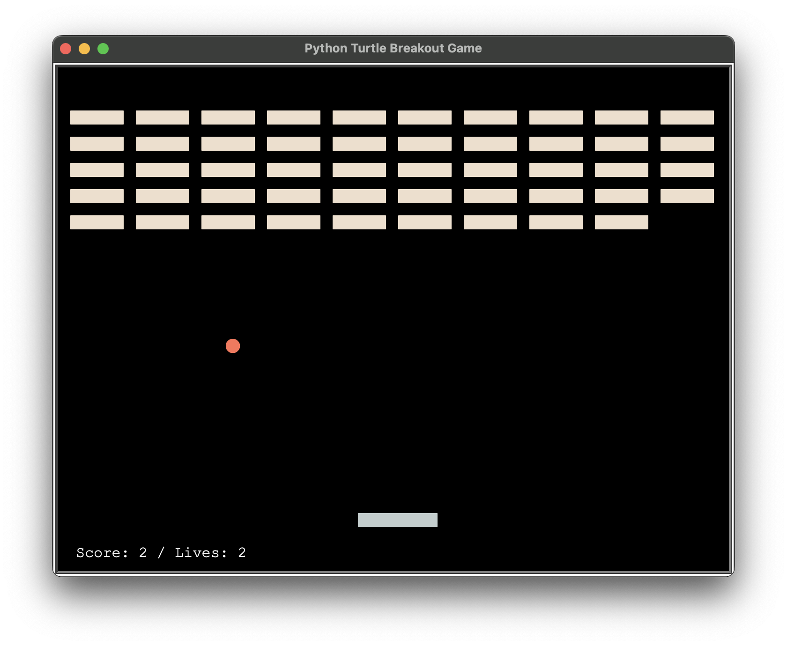
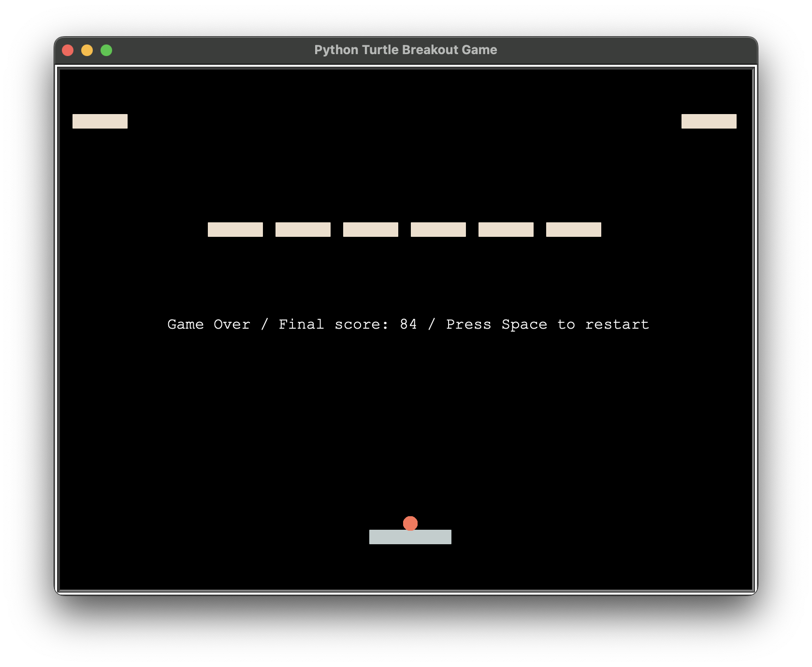

# py05_Breakout

Homework for *100 Days of Code: The Complete Python Pro Bootcamp for 2022*

A breakout game

* I must admit I'm becoming lazy. I want to have high score functions, fine tune the performance, but I didn't try hard enough.
* It might have memory issues, I only hide turtles instead of really deleting them.
* Bricks and paddles are made of several turtles, because it would be more accurate to detect the distance between them and the ball.

### Reference
* Code samples from the course *100 Days of Code: The Complete Python Pro Bootcamp for 2022*
* [turtle — Turtle graphics — Python 3.10.5 documentation](https://docs.python.org/3/library/turtle.html)